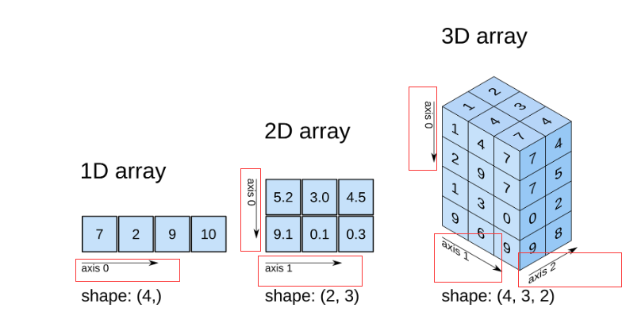

# Numpy数值计算基础入门

<a rel="license" href="http://creativecommons.org/licenses/by-nc-sa/4.0/"></a><br />本作品采用<a rel="license" href="http://creativecommons.org/licenses/by-nc-sa/4.0/">知识共享署名-非商业性使用-相同方式共享 4.0 国际许可协议</a>进行许可。

## 1. NumPy中的数据类型
|    类型    |                          解释                          |
| :--------: | :----------------------------------------------------: |
|    bool    |        布尔类型，1 个字节，值为 True 或 False。        |
|    int     |           整数类型，通常为 int64 或 int32 。           |
|    intc    |      与 C 里的 int 相同，通常为 int32 或 int64。       |
|    intp    |           用于索引，通常为 int32 或 int64。            |
|    int8    |                 字节（从 -128 到 127）                 |
|   int16    |               整数（从 -32768 到 32767）               |
|   int32    |          整数（从 -2147483648 到 2147483647）          |
|   int64    | 整数（从 -9223372036854775808 到 9223372036854775807） |
|   uint8    |               无符号整数（从 0 到 255）                |
|   uint16   |              无符号整数（从 0 到 65535）               |
|   uint32   |            无符号整数（从 0 到 4294967295）            |
|   uint64   |       无符号整数（从 0 到 18446744073709551615）       |
|   float    |                    float64 的简写。                    |
|  float16   |            半精度浮点，5 位指数，10 位尾数             |
|  float32   |            单精度浮点，8 位指数，23 位尾数             |
|  float64   |            双精度浮点，11 位指数，52 位尾数            |
|  complex   |                  complex128 的简写。                   |
| complex64  |              复数，由两个 32 位浮点表示。              |
| complex128 |              复数，由两个 64 位浮点表示。              |


在 NumPy 中，上面提到的这些数值类型都被归于 `dtype（data-type）` 对象的实例。
我们可以用 `numpy.dtype(object, align, copy)` 来指定数值类型。而在数组里面，可以用 `dtype=` 参数。

在Jupyter Notebook中运行以下代码，后续代码均在此环境下
```python
import numpy as np # 导入NumPy模块

a = np.array([1.1,2.2,3.3],dtype=np.float64) # 指定1维度数组的类型为float64
a, a.dtype # 查看a及dtype类型
```
一般在导入的时候都另名为np，方便后面代码输入
```python
a.astype(int).dtype #将a的数值类型从float64转换为int，并查看dtype类型
```

## 2. NumPy中的数组

Python中内置的三种形式的数组：
- 列表：`[1, 2, 3]`
- 元组：`(1, 2, 3, 4, 5)`
- 字典：`{A:1, B:2}`
> NumPy 最核心且最重要的一个特性就是 ndarray 多维数组对象，它区别于 Python 的标准类，拥有对高维数组的处理能力，这也是数值计算过程中缺一不可的重要特性。

NumPy 中，`ndarray` 类具有六个参数，它们分别为：
- `shape`：数组的形状。
- `dtype`：数据类型。
- `buffer`：对象暴露缓冲区接口。
- `offset`：数组数据的偏移量。
- `strides`：数据步长。
- `order`：`{'C'，'F'}`，以行或列为主排列顺序。

## 3.NumPy中创建数组

在 NumPy 中，我们主要通过以下 5 种途径创建数组:
- 从 Python 数组结构列表，元组等转换。
- 使用 `np.arange`、`np.ones`、`np.zeros` 等 NumPy 原生方法。
- 从存储空间读取数组。
- 通过使用字符串或缓冲区从原始字节创建数组。
- 使用特殊函数，如 `random`。
### 3.1 列表或元组的转换
使用 `numpy.array` 将列表或元组转换为 `ndarray` 数组。其方法为：
```python
numpy.array(object, dtype=None, copy=True, order=None, subok=False, ndmin=0)
```
参数如下：
 - `object`：列表、元组等。
 - `dtype`：数据类型。如果未给出，则类型为被保存对象所需的最小类型。
 - `copy`：布尔类型，默认 True，表示复制对象。
 - `order`：顺序。
 - `subok`：布尔类型，表示子类是否被传递。
 - `ndmin`：生成的数组应具有的最小维数。

通过列表创建一个`ndarray`数组
```python
np.array([[1, 2, 3], [4, 5, 6]])
```
通过元组创建一个`ndarray`数组
```python
np.ndarray([(1,2),(11,22),(111,222)])
```
### 3.2 NumPy原生方法创建`ndarray`
#### 3.2.1 arange方法创建
```python
numpy.arange(start, stop, step, dtype=None)
```
先设置值所在的区间 `[开始， 停止)`，这是一个半开半闭区间。然后，在设置 `step` 步长用于设置值之间的间隔。最后的可选参数 `dtype `可以设置返回`ndarray` 的值类型。
```python
np.arange(3,7,0.5,dtype='int32')
```
#### 3.2.2 linspace方法创建
```python
numpy.linspace(start, stop, num=50, endpoint=True, retstep=False, dtype=None)
```
- `start`：序列的起始值。
- `stop`：序列的结束值。
- `num`：生成的样本数。默认值为50。
- `endpoint`：布尔值，如果为真，则最后一个样本包含在序列内。
- `retstep`：布尔值，如果为真，返回间距。
- `dtype`：数组的类型。
创建数值有规律的数组。`linspace` 用于在指定的区间内返回间隔均匀的值

```python
np.linspace(0,20,15,endpoint=True)
```
#### 3.2.3 ones方法创建
`numpy.ones` 用于快速创建数值全部为 `1` 的多维数组。其方法如下：
```python
numpy.ones(shape, dtype=None, order='C')
```
- `shape`：用于指定数组形状，例如（1， 2）或 3。
- `dtype`：数据类型。
- `order`：`{'C'，'F'}`，按行或列方式储存数组。

```python
np.ones((2,5),order='C')
```
#### 3.2.4 zeros方法创建
`zeros` 方法和上面的 `ones` 方法非常相似，不同的地方在于，这里全部填充为 `0`
```python
numpy.zeros(shape, dtype=None, order='C')
```
- `shape`：用于指定数组形状，例如`（1， 2）`或` 3`。
- `dtype`：数据类型。
- `order`：`{'C'，'F'}`，按行或列方式储存数组

```python
np.zeros((3,5))
```

#### 3.2.5 eye方法创建

`numpy.eye` 用于创建一个二维数组，其特点是` k` 对角线上的值为 `1`，其余值全部为` 0`。方法如下：
```python 
numpy.eye(N, M=None, k=0, dtype=<type 'float'>)`
```

- `N`：输出数组的行数。
- `M`：输出数组的列数。
- `k`：对角线索引：0（默认）是指主对角线，其他数值可以理解为从主对角线向外数。正值是指上对角线，负值是指下对角线。
```python
np.eye(5, 4, -2)
```
### 3.3 从已知数据创建
从已知数据文件、函数中创建 `ndarray`。NumPy 提供了下面 `5` 个方法：
- `frombuffer（buffer）`：将缓冲区转换为 `1` 维数组。
- `fromfile（file，dtype，count，sep）`：从文本或二进制文件中构建多维数组。
- `fromfunction（function，shape）`：通过函数返回值来创建多维数组。
- `fromiter（iterable，dtype，count）`：从可迭代对象创建 `1` 维数组。
- `fromstring（string，dtype，count，sep）`：从字符串中创建 `1` 维数组。
通过`lambda`表达式返回值创建多维数组
```python
np.fromfunction(lambda a, b: a + b, (7, 8))
```

## 4 `ndarray`数组
### 4.1 `ndarray`数组属性
`ndarray.T` 用于数组的转置，与 `.transpose()` 相同。
`ndarray.dtype` 用来输出数组包含元素的数据类型。
`ndarray.imag` 用来输出数组包含元素的虚部。
`ndarray.real`用来输出数组包含元素的实部。
`ndarray.size`用来输出数组中的总包含元素数。
`ndarray.itemsize`输出一个数组元素的字节数。
`ndarray.nbytes`用来输出数组的元素总字节数。
`ndarray.ndim`用来输出数组维度。
`ndarray.shape`用来输出数组形状。
`ndarray.strides`用来遍历数组时，输出每个维度中步进的字节数组。 `ndarray.shape` 属性查看 NumPy 数组的形状。

### 4.2 `ndarray`基本操作

1. 重设形状

   `reshape` 可以在不改变数组数据的同时，改变数组的形状。其中，`numpy.reshape()` 等效于 `ndarray.reshape()`。

   ```python
   numpy.reshape(a, newshape)
   ```

2. 数组展开

   `ravel` 的目的是将任意形状的数组扁平化，变为 1 维数组。

   ```python
   numpy.ravel(a, order='C')
   ```

   a 表示需要处理的数组。`order` 表示变换时的读取顺序，默认是按照行依次读取，当 `order='F'` 时，可以按列依次读取排序。

3. 轴移动

   

   **注意记忆和理解上方图片中的轴`axis`，除了一维的横向为0外，其他的都是竖向为0，再横向为1，···**

   `moveaxis` 可以将数组的轴移动到新的位置

   ```python
   numpy.moveaxis(a, source, destination)
   ```

   - `a`：数组。
   - `source`：要移动的轴的原始位置。
   - `destination`：要移动的轴的目标位置。

   ```python
   a = np.ones((1, 2, 3))
   print(a)
   np.moveaxis(a, 0, -1)
   a.shape, np.moveaxis(a, 0, -1).shape
   
   out:
   [[[1. 1. 1.]
     [1. 1. 1.]]]
   array([[[1.],
           [1.],
           [1.]],
   
          [[1.],
           [1.],
           [1.]]])
   ((1, 2, 3), (2, 3, 1))
   ```

   上述代码示例可以看到，是将0轴移到最后的轴，原来0轴之后的轴依次成为前一个轴，`moveaxis`赋值为-1时，表示移到最后一个轴

4. 轴交换

   `swapaxes` 可以用来交换数组的轴

   ```python
   numpy.swapaxes(a, axis1, axis2)
   ```

   - `a`：数组。
   - `axis1`：需要交换的轴 1 位置。
   - `axis2`：需要与轴 1 交换位置的轴 1 位置。

5. 数组转置

   `transpose` 类似于矩阵的转置，它可以将 2 维数组的横轴和纵轴交换

   ```python
   numpy.transpose(a, axes=None)
   ```

   - `a`：数组。
   - `axis`：该值默认为 `none`，表示转置。如果有值，那么则按照值替换轴。

6. 维度改变

   `atleast_xd` 支持将输入数据直接视为 `x `维。这里的 `x` 可以表示：`1，2，3`。

   ```python
   numpy.atleast_1d()
   numpy.atleast_2d()
   numpy.atleast_3d()
   ```

7. 类型转换

   在 `NumPy`中，还有一系列以 as 开头的方法，它们可以将特定输入转换为数组，亦可将数组转换为矩阵、标量，`ndarray` 等

   - `asarray(a，dtype，order)`：将特定输入转换为数组。
   - `asanyarray(a，dtype，order)`：将特定输入转换为 `ndarray`。
   - `asmatrix(data，dtype)`：将特定输入转换为矩阵。
   - `asfarray(a，dtype)`：将特定输入转换为 `float` 类型的数组。
   - `asarray_chkfinite(a，dtype，order)`：将特定输入转换为数组，检查 `NaN` 或 `infs`。
   - `asscalar(a)`：将大小为 1 的数组转换为标量。

8. 数组连接

   `concatenate` 可以将多个数组沿指定轴连接在一起

   ```python
   numpy.concatenate((a1, a2, ...), axis=0)
   ```

   - `(a1, a2, ...)`：需要连接的数组。
   - `axis`：指定连接轴。

9. 数组堆叠

   在 `NumPy` 中，以下方法可用于数组的堆叠：

   - `stack(arrays，axis)`：沿着新轴连接数组的序列。
   - `column_stack()`：将 1 维数组作为列堆叠到 2 维数组中。
   - `hstack()`：按水平方向堆叠数组。
   - `vstack()`：按垂直方向堆叠数组。
   - `dstack()`：按深度方向堆叠数组。

10. 数组拆分

   `split` 及与之相似的一系列方法主要是用于数组的拆分，列举如下：

   - `split(ary，indices_or_sections，axis)`：将数组拆分为多个子数组。
   - `dsplit(ary，indices_or_sections)`：按深度方向将数组拆分成多个子数组。
   - `hsplit(ary，indices_or_sections)`：按水平方向将数组拆分成多个子数组。
   - `vsplit(ary，indices_or_sections)`：按垂直方向将数组拆分成多个子数组。

   ```python
   a = np.arange(10).reshape(2, 5)
   np.split(a, 2)
   ```

   输出为`[array([[0, 1, 2, 3, 4]]), array([[5, 6, 7, 8, 9]])]`

11. 删除

     `delete(arr，obj，axis)`：沿特定轴删除数组中的子数组

     ```python
     a = np.arange(12).reshape(3, 4)
     print(a)
     np.delete(a, 1, 1)
     #out:
     #[[ 0  1  2  3]
     #[ 4  5  6  7]
     #[ 8  9 10 11]]
     #array([[ 0,  2,  3],
     #       [ 4,  6,  7],
      #      [ 8, 10, 11]])
     ```

     上述代码输出结果对比可知，删除了轴一所在的维的索引为1的元素（数组），注意索引是从0开始数

12. 数组插入

     `insert(arr，obj，values，axis)`：依据索引在特定轴之前插入值。

     根据轴找到对应的维，根据索引在该维度上找到位置(相当于减少了一层方括号)，该位置即为插入的value（数组）

     ```python 
     a = np.arange(12).reshape(3, 4)
     print(a)
     b = np.ones((1,4),order='c')
     print(b)
     np.insert(a, 2, b, 0)
     #out:
     #[[ 0  1  2  3]
     # [ 4  5  6  7]
     # [ 8  9 10 11]]
     #[[1. 1. 1. 1.]]
     #array([[ 0,  1,  2,  3],
     #       [ 4,  5,  6,  7],
     #       [ 1,  1,  1,  1],
     #       [ 8,  9, 10, 11]])
     ```

13. 附加

     `append(arr，values，axis=None)`：将值附加到数组的末尾，并返回 1 维数组。 `append `方法返回值，默认是展平状态下的 1 维数组。

     ```python
     a = np.arange(6).reshape(2, 3)
     b = np.arange(3)
     
     np.append(a, b)
     #out:
     #array([0, 1, 2, 3, 4, 5, 0, 1, 2])
     ```

14. 重设尺寸

     `resize(a，new_shape)`：对数组尺寸进行重新设定。

     ```python
     a = np.arange(10)
     print(a)
     a.resize(2, 5)
     a
     #out:
     #[0 1 2 3 4 5 6 7 8 9]
     #array([[0, 1, 2, 3, 4],
     #       [5, 6, 7, 8, 9]])
     ```

     **注意**

     `reshape` 在改变形状时，不会影响原数组，相当于对原数组做了一份拷贝。而 `resize` 则是对原数组执行操作。

15. 翻转数组

     - `fliplr(m)`：左右翻转数组。
     - `flipud(m)`：上下翻转数组。

     ```python
     a = np.arange(16).reshape(4, 4)
     print(a)
     print(np.fliplr(a))
     print(np.flipud(a))
     #out:
     #[[ 0  1  2  3]
     # [ 4  5  6  7]
     # [ 8  9 10 11]
     # [12 13 14 15]]
     #[[ 3  2  1  0]
     # [ 7  6  5  4]
     # [11 10  9  8]
     # [15 14 13 12]]
     #[[12 13 14 15]
     # [ 8  9 10 11]
     # [ 4  5  6  7]
     # [ 0  1  2  3]]
     ```

## 5. NumPy随机数

1. `numpy.random.rand(d0, d1, ..., dn)` 方法的作用为：指定一个d0-d1-d···-dn维的数组组，并使用 `[0, 1)` 区间随机数据填充，这些数据均匀分布。

```python
np.random.rand(2, 5)
#out:
#array([[0.68175919, 0.15680393, 0.62421061, 0.58063122, 0.78281924],
#       [0.70138362, 0.74113612, 0.55429168, 0.60597981, 0.98325056]])
```

2. `numpy.random.randn(d0, d1, ..., dn)` 与 `numpy.random.rand(d0, d1, ..., dn)` 的区别在于，前者是从**标准正态分布**中返回一个或多个样本值。

   ```python
   np.random.randn(1, 10)
   #out:
   #array([[-0.87408796, -2.04875312, -2.50382945,  0.95299501, -0.804148  ,
   #         0.71335989,  1.83261663,  0.2642229 , -1.04539801, -0.16058894]])
   ```

3. `randint(low, high, size, dtype)` 方法将会生成 `[low, high)` 的随机整数。注意这是一个左闭右开区间。

4. `random_sample(size)` 方法将会在 `[0, 1)` 区间内生成指定 `size` 个数的随机**浮点数**

   类似的还有

   - `numpy.random.random([size])`
   - `numpy.random.ranf([size])`
   - `numpy.random.sample([size])`

5. `choice(a, size, replace, p)` 方法将会给定的数组里随机抽取几个值，该方法类似于随机抽样。

## 6. 概率密度分布

- `numpy.random.beta(a，b，size)`：从 Beta 分布中生成随机数。
- `numpy.random.binomial(n, p, size)`：从二项分布中生成随机数。
- `numpy.random.chisquare(df，size)`：从卡方分布中生成随机数。
- `numpy.random.dirichlet(alpha，size)`：从 Dirichlet 分布中生成随机数。
- `numpy.random.exponential(scale，size)`：从指数分布中生成随机数。
- `numpy.random.f(dfnum，dfden，size)`：从 F 分布中生成随机数。
- `numpy.random.gamma(shape，scale，size)`：从 Gamma 分布中生成随机数。
- `numpy.random.geometric(p，size)`：从几何分布中生成随机数。
- `numpy.random.gumbel(loc，scale，size)`：从 Gumbel 分布中生成随机数。
10. `numpy.random.hypergeometric(ngood, nbad, nsample, size)`：从超几何分布中生成随机数。
- `numpy.random.laplace(loc，scale，size)`：从拉普拉斯双指数分布中生成随机数。
- `numpy.random.logistic(loc，scale，size)`：从逻辑分布中生成随机数。
- `numpy.random.lognormal(mean，sigma，size)`：从对数正态分布中生成随机数。
- `numpy.random.logseries(p，size)`：从对数系列分布中生成随机数。
- `numpy.random.multinomial(n，pvals，size)`：从多项分布中生成随机数。
- `numpy.random.multivariate_normal(mean, cov, size)`：从多变量正态分布绘制随机样本。
- `numpy.random.negative_binomial(n, p, size)`：从负二项分布中生成随机数。
- `numpy.random.noncentral_chisquare(df，nonc，size)`：从非中心卡方分布中生成随机数。
- `numpy.random.noncentral_f(dfnum, dfden, nonc, size)`：从非中心 F 分布中抽取样本。
20. `numpy.random.normal(loc，scale，size)`：从正态分布绘制随机样本。
- `numpy.random.pareto(a，size)`：从具有指定形状的 Pareto II 或 Lomax 分布中生成随机数。
- `numpy.random.poisson(lam，size)`：从泊松分布中生成随机数。
- `numpy.random.power(a，size)`：从具有正指数 a-1 的功率分布中在 0，1 中生成随机数。
- `numpy.random.rayleigh(scale，size)`：从瑞利分布中生成随机数。
- `numpy.random.standard_cauchy(size)`：从标准 Cauchy 分布中生成随机数。
- `numpy.random.standard_exponential(size)`：从标准指数分布中生成随机数。
- `numpy.random.standard_gamma(shape，size)`：从标准 Gamma 分布中生成随机数。
- `numpy.random.standard_normal(size)`：从标准正态分布中生成随机数。
- `numpy.random.standard_t(df，size)`：从具有 df 自由度的标准学生 t 分布中生成随机数。
30. `numpy.random.triangular(left，mode，right，size)`：从三角分布中生成随机数。
- `numpy.random.uniform(low，high，size)`：从均匀分布中生成随机数。
- `numpy.random.vonmises(mu，kappa，size)`：从 von Mises 分布中生成随机数。
- `numpy.random.wald(mean，scale，size)`：从 Wald 或反高斯分布中生成随机数。
- `numpy.random.weibull(a，size)`：从威布尔分布中生成随机数。
- `numpy.random.zipf(a，size)`：从 Zipf 分布中生成随机数。

## 7. NumPy中的数学函数

### 7.1 三角函数

- `numpy.sin(x)`：三角正弦。
- `numpy.cos(x)`：三角余弦。
- `numpy.tan(x)`：三角正切。
- `numpy.arcsin(x)`：三角反正弦。
- `numpy.arccos(x)`：三角反余弦。
- `numpy.arctan(x)`：三角反正切。
- `numpy.hypot(x1,x2)`：直角三角形求斜边。
- `numpy.degrees(x)`：弧度转换为度。
- `numpy.radians(x)`：度转换为弧度。
- `numpy.deg2rad(x)`：度转换为弧度。
- `numpy.rad2deg(x)`：弧度转换为度。

### 7.2 双曲函数

- `numpy.sinh(x)`：双曲正弦。
- `numpy.cosh(x)`：双曲余弦。
- `numpy.tanh(x)`：双曲正切。
- `numpy.arcsinh(x)`：反双曲正弦。
- `numpy.arccosh(x)`：反双曲余弦。
- `numpy.arctanh(x)`：反双曲正切。

### 7.3 数值修约

- `numpy.around(a)`：平均到给定的小数位数。
- `numpy.round_(a)`：将数组舍入到给定的小数位数。
- `numpy.rint(x)`：修约到最接近的整数。
- `numpy.fix(x, y)`：向 0 舍入到最接近的整数。
- `numpy.floor(x)`：返回输入的底部(标量 x 的底部是最大的整数 i)。
- `numpy.ceil(x)`：返回输入的上限(标量 x 的底部是最小的整数 i).
- `numpy.trunc(x)`：返回输入的截断值。

### 7.4 求和积分差分

下面这些方法用于数组内元素或数组间进行求和、求积以及进行差分。

- `numpy.prod(a, axis, dtype, keepdims)`：返回指定轴上的数组元素的乘积。
- `numpy.sum(a, axis, dtype, keepdims)`：返回指定轴上的数组元素的总和。
- `numpy.nanprod(a, axis, dtype, keepdims)`：返回指定轴上的数组元素的乘积, 将 NaN 视作 1。
- `numpy.nansum(a, axis, dtype, keepdims)`：返回指定轴上的数组元素的总和, 将 NaN 视作 0。
- `numpy.cumprod(a, axis, dtype)`：返回沿给定轴的元素的累积乘积。
- `numpy.cumsum(a, axis, dtype)`：返回沿给定轴的元素的累积总和。
- `numpy.nancumprod(a, axis, dtype)`：返回沿给定轴的元素的累积乘积, 将 NaN 视作 1。
- `numpy.nancumsum(a, axis, dtype)`：返回沿给定轴的元素的累积总和, 将 NaN 视作 0。
- `numpy.diff(a, n, axis)`：计算沿指定轴的第 n 个离散差分。
- `numpy.ediff1d(ary, to_end, to_begin)`：数组的连续元素之间的差异。
- `numpy.gradient(f)`：返回 N 维数组的梯度。
- `numpy.cross(a, b, axisa, axisb, axisc, axis)`：返回两个(数组）向量的叉积。
- `numpy.trapz(y, x, dx, axis)`：使用复合梯形规则沿给定轴积分。

### 7.5 指数和对数

- `numpy.exp(x)`：计算输入数组中所有元素的指数。
- `numpy.log(x)`：计算自然对数。
- `numpy.log10(x)`：计算常用对数。
- `numpy.log2(x)`：计算二进制对数。

### 7.6 算术运算

- `numpy.add(x1, x2)`：对应元素相加。
- `numpy.reciprocal(x)`：求倒数 1/x。
- `numpy.negative(x)`：求对应负数。
- `numpy.multiply(x1, x2)`：求解乘法。
- `numpy.divide(x1, x2)`：相除 x1/x2。
- `numpy.power(x1, x2)`：类似于 x1^x2。
- `numpy.subtract(x1, x2)`：减法。
- `numpy.fmod(x1, x2)`：返回除法的元素余项。
- `numpy.mod(x1, x2)`：返回余项。
- `numpy.modf(x1)`：返回数组的小数和整数部分。
- `numpy.remainder(x1, x2)`：返回除法余数。

### 7.7 矩阵系列

- `numpy.dot(a, b)`：求解两个数组的点积。
- `numpy.vdot(a, b)`：求解两个向量的点积。
- `numpy.inner(a, b)`：求解两个数组的内积。
- `numpy.outer(a, b)`：求解两个向量的外积。
- `numpy.matmul(a, b)`：求解两个数组的矩阵乘积。
- `numpy.tensordot(a, b)`：求解张量点积。
- `numpy.kron(a, b)`：计算 [Kronecker 乘积](https://baike.baidu.com/item/%E5%85%8B%E7%BD%97%E5%86%85%E5%85%8B%E7%A7%AF/6282573?fr=aladdin)。（对应位置相乘）

- `numpy.linalg.cholesky(a)`：[Cholesky 分解](https://blog.csdn.net/qq_41564404/article/details/88085073)。
- `numpy.linalg.qr(a ,mode)`：计算矩阵的 [QR 因式分解](https://blog.csdn.net/weixin_33802505/article/details/91741893)。
- `numpy.linalg.svd(a ,full_matrices,compute_uv)`：奇异值分解。
- `numpy.linalg.eig(a)`：计算正方形数组的特征值和右特征向量。
- `numpy.linalg.eigh(a, UPLO)`：返回 Hermitian 或对称矩阵的特征值和特征向量。
- `numpy.linalg.eigvals(a)`：计算矩阵的特征值。
- `numpy.linalg.eigvalsh(a, UPLO)`：计算 Hermitian 或真实对称矩阵的特征值。
- `numpy.linalg.norm(x ,ord,axis,keepdims)`：计算矩阵或向量范数。
- `numpy.linalg.cond(x ,p)`：计算矩阵的条件数。
- `numpy.linalg.det(a)`：计算数组的行列式。
- `numpy.linalg.matrix_rank(M ,tol)`：使用奇异值分解方法返回秩。
- `numpy.linalg.slogdet(a)`：计算数组的行列式的符号和自然对数。
- `numpy.trace(a ,offset,axis1,axis2,dtype,out)`：沿数组的对角线返回总和。
- `numpy.linalg.solve(a, b)`：求解线性矩阵方程或线性标量方程组。
- `numpy.linalg.tensorsolve(a, b ,axes)`：为 x 解出张量方程 a x = b
- `numpy.linalg.lstsq(a, b ,rcond)`：将最小二乘解返回到线性矩阵方程。
- `numpy.linalg.inv(a)`：计算逆矩阵。
- `numpy.linalg.pinv(a ,rcond)`：计算矩阵的（Moore-Penrose）伪逆。
- `numpy.linalg.tensorinv(a ,ind)`：计算 N 维数组的逆。

### 7.8 其他

- `numpy.angle(z, deg)`：返回复参数的角度。
- `numpy.real(val)`：返回数组元素的实部。
- `numpy.imag(val)`：返回数组元素的虚部。
- `numpy.conj(x)`：按元素方式返回共轭复数。
- `numpy.convolve(a, v, mode)`：返回线性卷积。
- `numpy.sqrt(x)`：平方根。
- `numpy.cbrt(x)`：立方根。
- `numpy.square(x)`：平方。
- `numpy.absolute(x)`：绝对值, 可求解复数。
- `numpy.fabs(x)`：绝对值。
- `numpy.sign(x)`：符号函数。
- `numpy.maximum(x1, x2)`：最大值。
- `numpy.minimum(x1, x2)`：最小值。
- `numpy.nan_to_num(x)`：用 0 替换 NaN。
- `numpy.interp(x, xp, fp, left, right, period)`：线性插值。

## 8. 数组索引和切片

### 8.1 数组索引

我们可以通过索引值（从 0 开始）来访问` Ndarray `中的特定位置元素。NumPy 中的索引和 Python 对 list 索引的方式非常相似，但又有所不同。

```python
import numpy as np
a = np.arange(10)  # 生成 0-9
a[[1, 2, 3]]#分别获取索引值为 1，2，3 的数据

a = np.arange(20).reshape(4, 5)
#获取第 2 行，第 3 列的数据。
a[1, 2]#注意list的索引形式为a[1][2]
a = np.arange(30).reshape(2, 5, 3)
a[[0, 1], [1, 2], [1, 2]]
#注意上述三维下索引的分量是每个[]中取一个，上述相当于找（0，1，1）和（1,2,2）对应位置的元素，最后输出的是两个值
```

### 8.2 数组切片

NumPy 里面针对` Ndarray `的数组切片和 Python 里的` list` 切片操作是一样的

```python
Ndarray[start:stop:step]
```

`[start:stop:step]` 分别代表 `[起始索引:截至索引:步长]`

对于多维数组，我们只需要用逗号 `,` 分割不同维度即可：

```python
a = np.arange(20).reshape(4, 5)
a
#out:
#array([[ 0,  1,  2,  3,  4],
#       [ 5,  6,  7,  8,  9],
#       [10, 11, 12, 13, 14],
#       [15, 16, 17, 18, 19]])
a[0:3, 2:4]
#表示在第一个维度上切片[0:3]，第二个维度上切片[2:4]
a[:, ::2]# 按步长为 2 取所有列和所有行的数据。
```

### 8.3 排序

使用 `numpy.sort `方法对多维数组元素进行排序

```python
numpy.sort(a, axis=-1, kind='quicksort', order=None)
```

- `a`：数组。
- `axis`：要排序的轴。如果为` None`，则在排序之前将数组铺平。默认值为 `-1`，沿最后一个轴排序。沿最后一个轴排序可以理解为，在输出结果上，只对最内层的[ ]中的元素进行排序
- `kind`：`{'quicksort'，'mergesort'，'heapsort'}`，排序算法。默认值为 `quicksort`。

其他排序方式

- `numpy.lexsort(keys ,axis)`：使用多个键进行间接排序。
- `numpy.argsort(a ,axis,kind,order)`：沿给定轴执行间接排序。
- `numpy.msort(a)`：沿第 1 个轴排序。
- `numpy.sort_complex(a)`：针对复数排序。

### 8.4 搜索计数

- `argmax(a ,axis,out)`：返回数组中指定轴的最大值的索引。
- `nanargmax(a ,axis)`：返回数组中指定轴的最大值的索引,忽略 NaN。
- `argmin(a ,axis,out)`：返回数组中指定轴的最小值的索引。
- `nanargmin(a ,axis)`：返回数组中指定轴的最小值的索引,忽略 NaN。
- `argwhere(a)`：返回数组中非 0 元素的索引,按元素分组。
- `nonzero(a)`：返回数组中非 0 元素的索引。
- `flatnonzero(a)`：返回数组中非 0 元素的索引,并铺平。
- `where(条件,x,y)`：根据指定条件,从指定行、列返回元素。
- `searchsorted(a,v ,side,sorter)`：查找要插入元素以维持顺序的索引。
- `extract(condition,arr)`：返回满足某些条件的数组的元素。

- `count_nonzero(a)`：计算数组中非 0 元素的数量。

